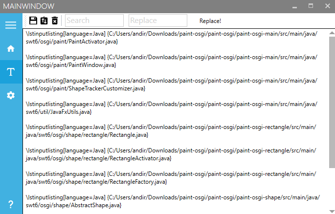
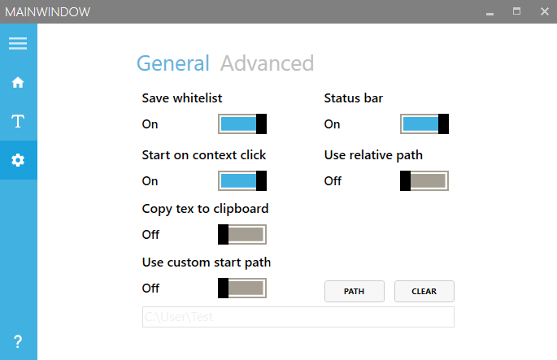
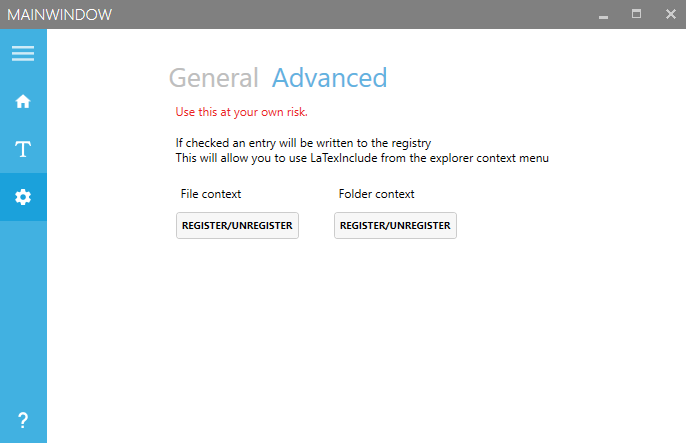

<h1 align="center">
   
  VS-LaTeX-Include
   
  - Archived -

  
</h1>

# Preface

This project is archived and is for future reference only. Use code samples at your own risk.

### What it does:

VS-LaTeX-Include generates a .tex file containing stylized content based on different file types (Code, Images, PDF,...) from a folder.
You can customize the output .tex according to your needs.
* Change Title, Date and other basic inormation
* Add Sections and subsections
* Change the order of your listed files

#### Example

Say you want to include different files in different folders in a .tex file.

  

VS-LaTeX-Include does the job for you so you don't have to worry about those pesky path declerations.

#### Showcase

  

  

  

  

### Installation

[VS-LaTeX-Include release](https://github.com/AndreasRoither/VS-LaTexInclude/releases)  

### How to use

Place the executable wherever you desire and run it.

### INFO

There is a possibility to register the .exe in the registry. This allows you to use LaTexInclude via the context menu (right click on a file or a folder) and start LaTexInclude with the file(s) in its List. If you uncheck the "Start with context" setting under "Settings -> General" an output.tex file will be generated in the folder you are in.

In order to add the context menu item you need to do the following:  

- Start the .exe as administrator
- Go to settings -> advanced
- Click one of the buttons (File/Folder)
- Enjoy

### Technology used

Built with [Visual Studio](https://www.visualstudio.com/downloads/)

#### Framework:

* MVVM Light Toolkit

#### Nuggets:

* Install-Package WindowsAPICodePack-Core
* Install-Package WindowsAPICodePack-ExtendedLinguisticServices
* Install-Package WindowsAPICodePack-Sensors
* Install-Package WindowsAPICodePack-Shell
* Install-Package WindowsAPICodePack-ShellExtensions
* Install-Package Extended.Wpf.Toolkit
* Install-Package Costura.Fody
* Install-CleanReferencesTarget

#### UI Framework MahApps Metro:

* Install-Package MahApps.Metro
