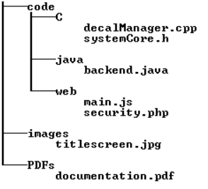

# VS-LaTeX-Include

### What it does:

VS-LaTeX-Include generates a .tex file containing stylized content based on different file types (Code, Images, PDF,...) from a folder.
You can customize the output .tex according to your needs.
* Change Title, Date and other basic inormation
* Add Sections and subsections
* Change the order of your listed files

#### Example
Say you want to include different files in different folders in a .tex file.

  

VS-LaTeX-Include does the job for you so you don't have to worry about those pesky path declerations.

### Installation
Clone or [download](https://github.com/AndiRoither/VS-LatechInclude/archive/master.zip) this project and unzip it.

### How to use
Place the executable wherever you desire and run it.

### Technology used
Built with [Visual Studio](https://www.visualstudio.com/downloads/)

#### Framework:
* MVVM Light Toolkit

#### Nuggets:
* Install-Package WindowsAPICodePack-Core
* Install-Package WindowsAPICodePack-ExtendedLinguisticServices
* Install-Package WindowsAPICodePack-Sensors
* Install-Package WindowsAPICodePack-Shell
* Install-Package WindowsAPICodePack-ShellExtensions
* Install-Package Extended.Wpf.Toolkit

#### UI Framework MahApps Metro:
* Install-Package MahApps.Metro

#### Dependencies:
* ObservableList OrderBy needs using System.Linq;